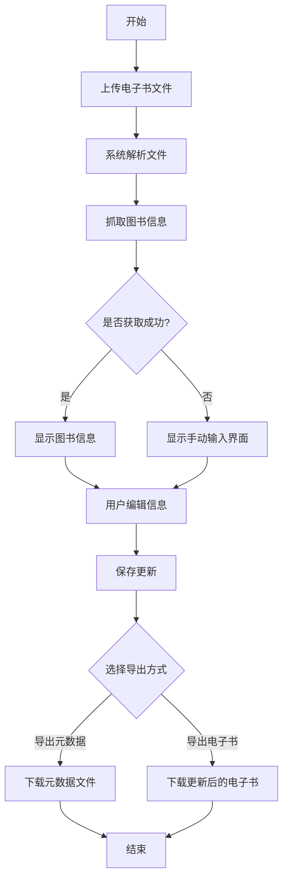
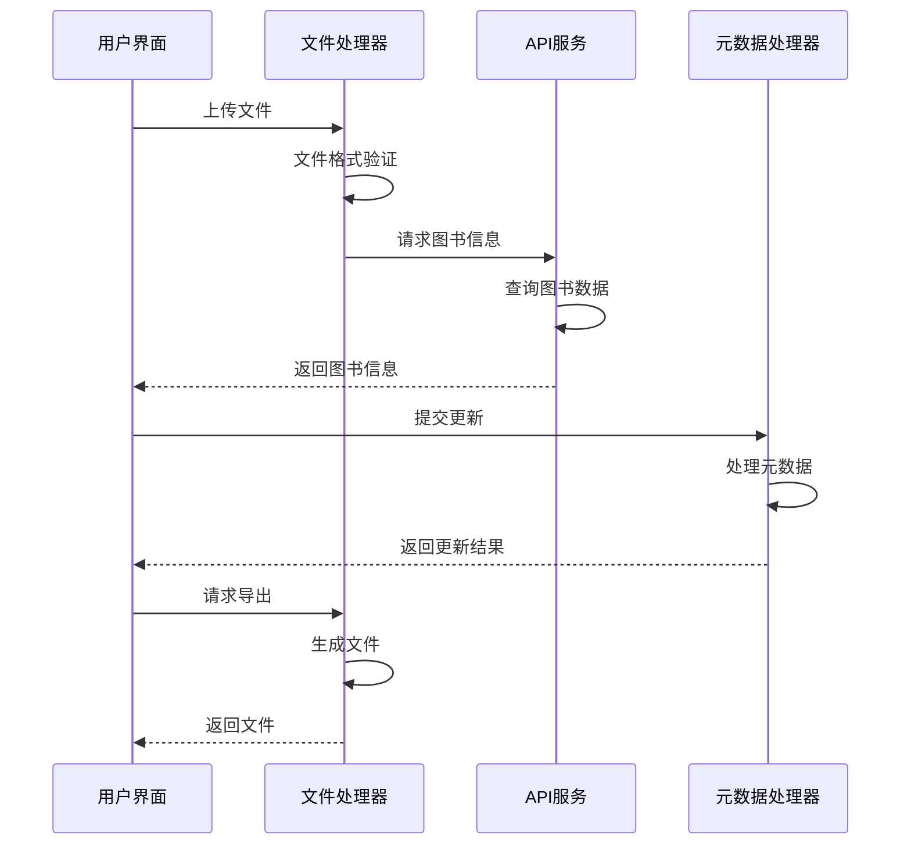

# 图书信息查询与更新功能设计文档

## 1. 功能概述

图书信息查询与更新功能旨在帮助用户快速获取和更新电子书的元数据信息。用户可以通过上传电子书文件，系统自动抓取图书相关信息，用户可以编辑和确认这些信息，最后导出更新后的元数据或带有新元数据的电子书文件。

### 1.1 核心功能

- 文件上传：支持上传电子书文件
- 信息抓取：自动获取图书元数据信息
- 信息编辑：支持编辑和修改图书元数据
- 数据导出：支持导出元数据和更新后的电子书

## 2. 用户流程

## 3. 界面设计

### 3.1 文件上传区域

- 拖拽上传区域
- 文件选择按钮
- 支持格式提示
- 上传进度显示

### 3.2 信息编辑区域

- 图书基本信息表单
  - 标题
  - 作者
  - ISBN
  - 出版社
  - 出版日期
  - 简介
  - 封面图片
- 预览区域
  - 封面预览
  - 元数据预览

### 3.3 操作区域

- 保存按钮
- 导出选项
  - 导出元数据
  - 导出电子书
- 重置按钮

## 4. 技术实现

### 4.1 数据流转

### 4.2 关键技术点

1. 文件处理

   - 文件格式验证
   - 文件读取和解析
   - 元数据提取和注入

2. 数据抓取

   - ISBN 查询
   - 在线书库 API 对接
   - 数据清洗和转换

3. 数据存储
   - 本地缓存
   - 历史记录
   - 用户偏好设置

## 5. 错误处理

### 5.1 上传阶段

- 文件格式不支持
- 文件大小超限
- 文件损坏
- 上传中断

### 5.2 信息获取阶段

- API 请求失败
- 数据解析错误
- 超时处理

### 5.3 导出阶段

- 文件写入失败
- 格式转换错误
- 空间不足

## 6. 后续优化

1. 性能优化

   - 文件处理优化
   - 并发请求处理
   - 缓存策略优化

2. 用户体验

   - 批量处理支持
   - 快捷键支持
   - 自定义模板

3. 功能扩展
   - 更多元数据源支持
   - 更多文件格式支持
   - 元数据验证规则
