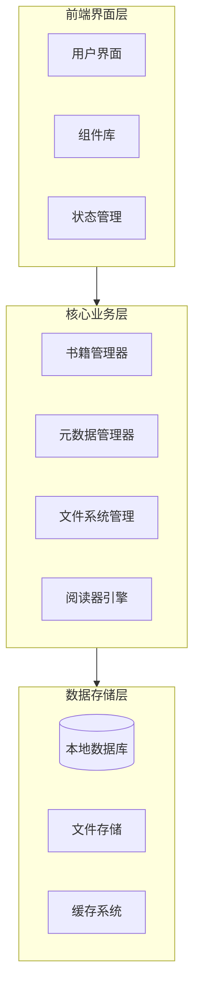
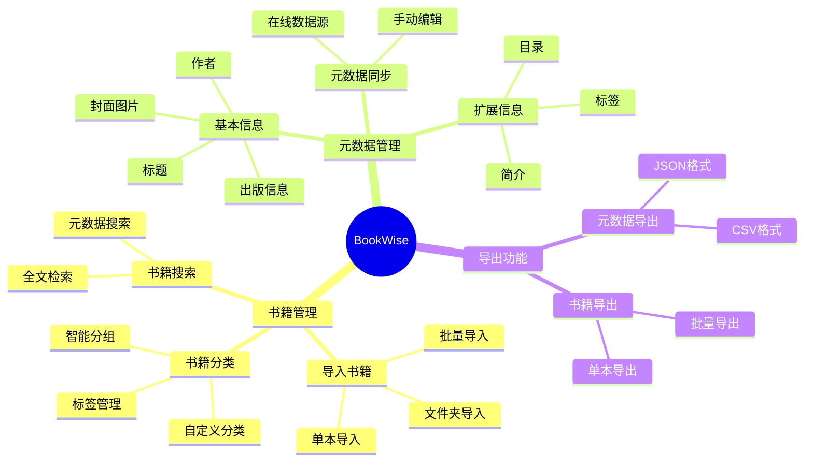
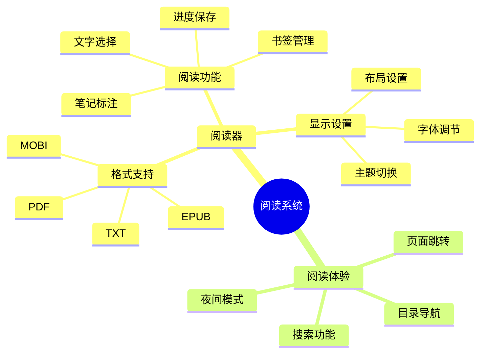
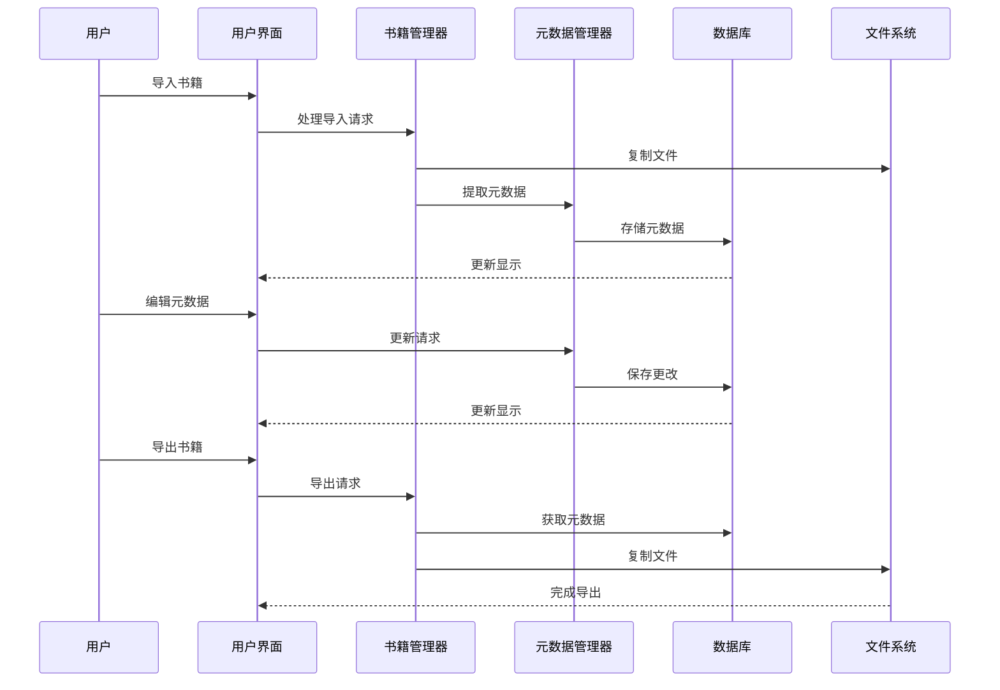
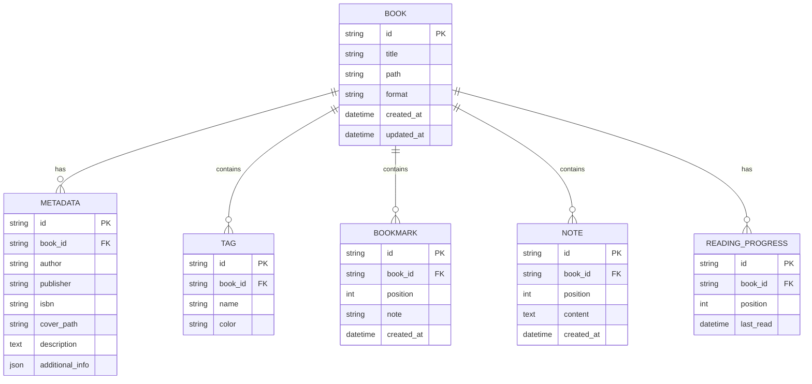

# BookWise 产品设计文档

## 1. 产品概述

BookWise 是一款专注于电子书管理和阅读的桌面应用程序，旨在为用户提供一个高效、便捷的电子书管理和阅读平台。产品分两个阶段开发：第一阶段实现电子书管理系统的核心功能，第二阶段添加电子书阅读功能。

## 2. 系统架构

## 3. 功能模块设计

### 3.1 第一阶段：电子书管理系统

### 3.2 第二阶段：电子书阅读功能

## 4. 数据流程

## 5. 数据库设计

## 6. 技术栈选择

- **前端框架**：Electron + React
  - 使用 Electron 构建跨平台桌面应用
  - React 提供高效的 UI 开发体验
  - TypeScript 确保代码质量和可维护性

- **状态管理**：Redux + Redux Toolkit
  - 集中管理应用状态
  - 提供可预测的状态更新

- **数据存储**：
  - SQLite：本地数据库，存储元数据和用户数据
  - 文件系统：管理电子书文件和资源

- **阅读引擎**：
  - PDF.js：PDF 文件渲染
  - EPub.js：EPUB 格式支持
  - 自定义渲染引擎：其他格式支持

## 7. 开发路线图

### 第一阶段（3个月）

1. 月度 1：基础框架搭建
   - 项目初始化和架构设计
   - 数据库设计和实现
   - 基础 UI 组件开发

2. 月度 2：核心功能实现
   - 书籍导入导出功能
   - 元数据管理系统
   - 文件系统集成

3. 月度 3：功能完善和优化
   - 搜索和过滤功能
   - 批量操作功能
   - 性能优化和测试

### 第二阶段（4个月）

1. 月度 4：阅读器基础功能
   - EPUB 格式支持
   - 基础阅读功能实现
   - 进度保存功能

2. 月度 5：阅读器进阶功能
   - PDF 格式支持
   - 笔记和标注功能
   - 主题和布局设置

3. 月度 6：多格式支持
   - MOBI 格式支持
   - TXT 格式支持
   - 格式转换功能

4. 月度 7：性能优化和体验提升
   - 性能优化
   - 用户体验改进
   - 错误处理和稳定性提升

## 8. 关键技术点

1. **文件系统处理**
   - 大文件读写优化
   - 文件格式识别和验证
   - 文件系统监控和同步

2. **元数据管理**
   - 元数据提取算法
   - 在线数据源集成
   - 数据同步机制

3. **阅读引擎**
   - 多格式渲染支持
   - 性能优化策略
   - 内存管理

4. **用户体验**
   - 响应式设计
   - 快捷键支持
   - 主题定制

## 9. 安全考虑

1. **文件系统安全**
   - 文件访问权限控制
   - 文件完整性验证
   - 安全的文件操作

2. **数据安全**
   - 数据库加密
   - 用户数据保护
   - 备份和恢复机制

3. **应用安全**
   - 输入验证和清理
   - 错误处理和日志
   - 更新机制
